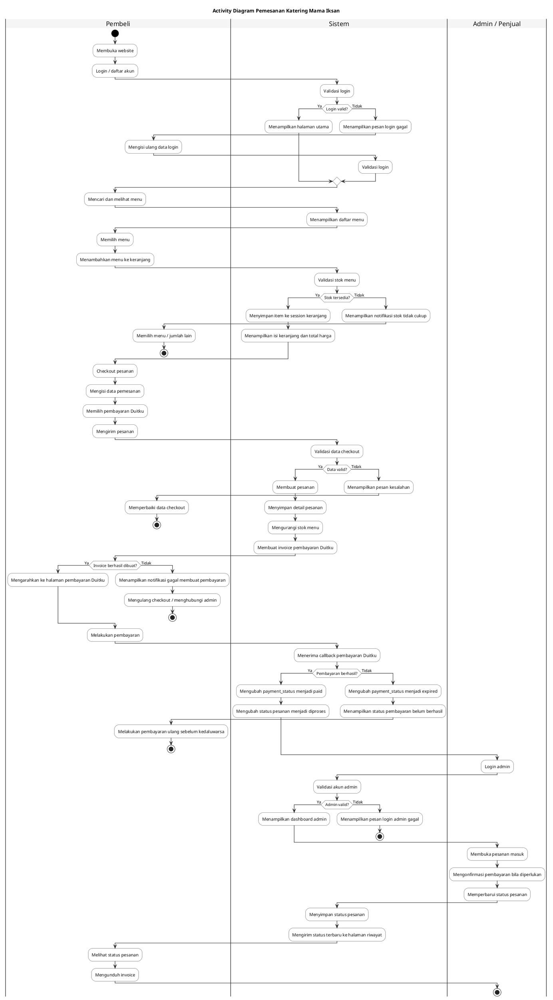
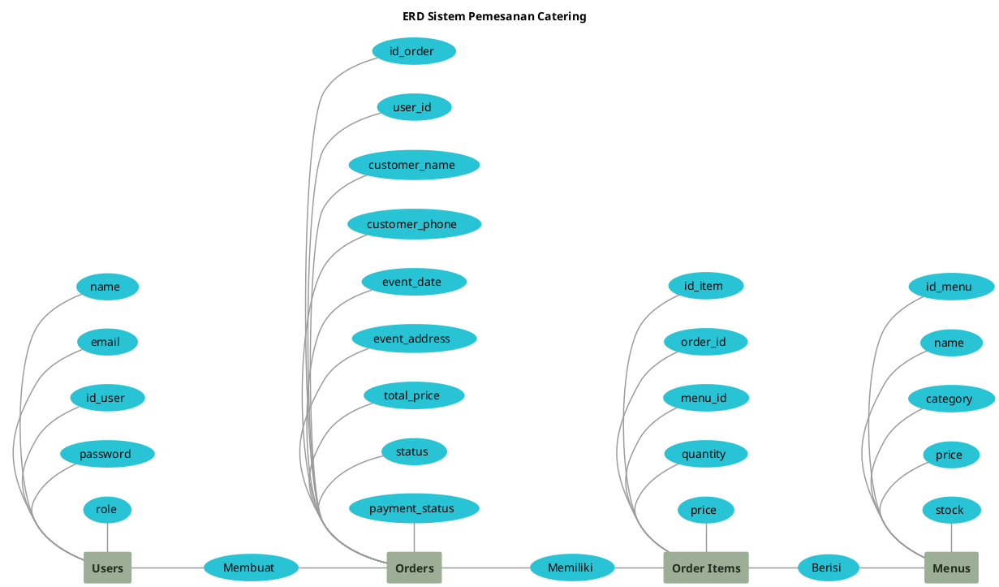
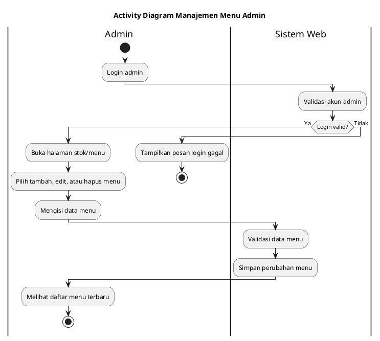
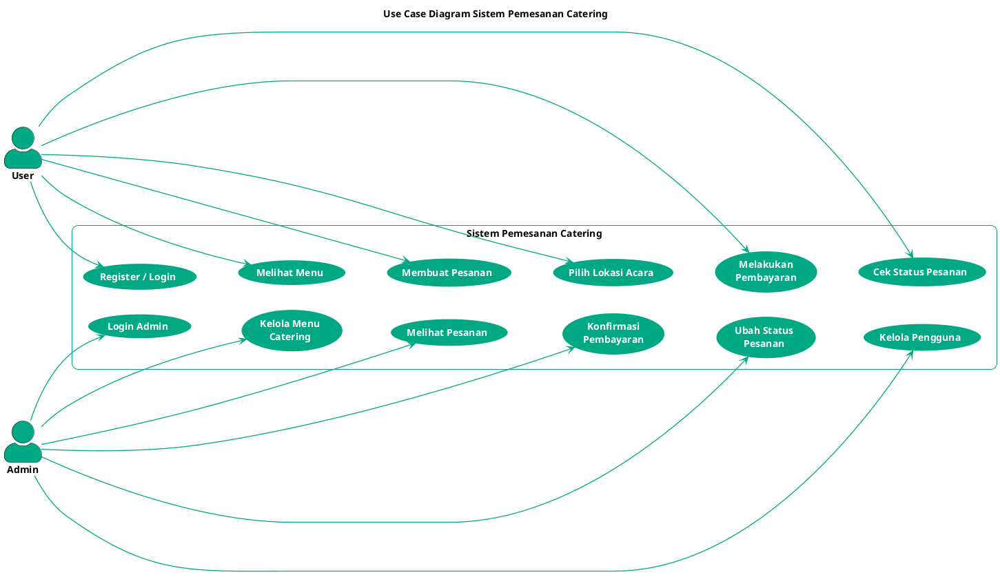

# Activity Diagram Web Risha Catering

Diagram ini dibuat lebih sederhana agar mudah dimasukkan ke draw.io / PlantUML dan tetap menggambarkan alur utama sistem.

## Activity Diagram Pemesanan Katering

Copy mulai dari `@startuml` sampai `@enduml`, lalu paste ke draw.io melalui **Arrange > Insert > Advanced > PlantUML**.

## ERD Diagram

Copy mulai dari `@startuml` sampai `@enduml`, lalu paste ke draw.io melalui **Arrange > Insert > Advanced > PlantUML**.

## Activity Diagram Manajemen Menu Admin

## Swimlane

- **Pelanggan**: memilih menu, checkout, membayar, melihat status, dan mengunduh invoice.
- **Sistem Web**: memvalidasi data, menyimpan pesanan, membuat pembayaran, dan memperbarui status.
- **Duitku**: menangani halaman pembayaran dan mengirim status pembayaran.
- **Admin**: melihat pesanan, mengubah status pesanan, dan mengelola menu.

## Use Case Diagram

Copy mulai dari `@startuml` sampai `@enduml`, lalu paste ke draw.io melalui **Arrange > Insert > Advanced > PlantUML**.

